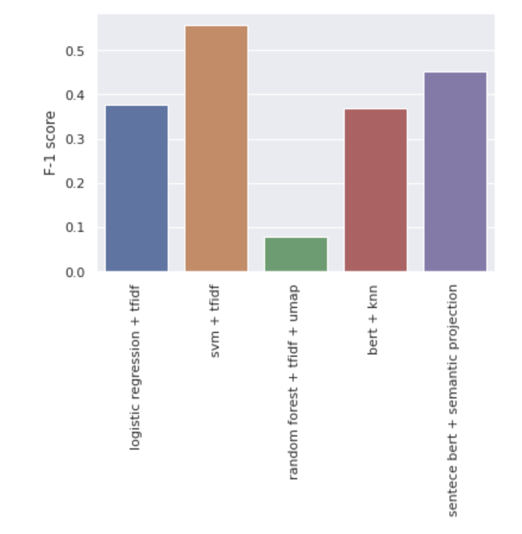
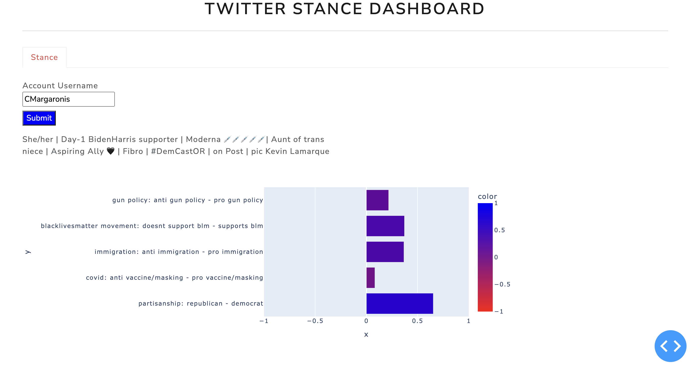

# Project overview

## question and the challenges

In this project, I started by analyzing twitter's user profiles with this question in mind: **Can we predict the stance
of a person on a specific topic by analyzing their social media?**
To answer this question I gathered a huge dataset of 14M user profiles from twitter and relaxed my
question by only looking at users' profile bios instead of their whole tweets. In the first
two phases of the project, I only focused on partisanship as a social stance and in the 
second phase I gathered an annotated dataset of people's partisanship along with their
profile bios to better answer this question.

## phase1 overview

In phase one, to perform an exploratory data analysis, I gathered 14M user profile bios from
twitter. The full notebook is a part of `notebooks/personal_identifiers_pyspark.ipynb`. In 
this phase I found out that twitter bios contain very informative phrases that represent a 
user's stance on various social topics.

## phase2 overview

In the second phase, I gathered a dataset of annotated twitter bios with their political 
partisanship label and trained various models and in the end chose the best model by f1 
score as the final evaluation metric. The chosen model is a semi-supervised approach in 
which I fine-tuned a large language model on twitter bios and then use that in an 
unsupervised fashion to project bios onto political dimension to measure partisanship. 
Since this approach is extendable to other social topics without the need for annotated 
dataset and also the F1 score of this model was about as high as the best model, I chose
to use this model for third phase.

# Model

According to the final evaluation of the models and the comparison on their f1 scores 
in phase 2 which is represented in the figure below



and the reasons described in the previous section I use a fine-tuned version of a
language model in this phase. Since the fine-tuning process is out of scope of this 
lecture, I skip it here. The required training code for fine-tuning a language model
from scratch on a new dataset is in the `src/` package. In order to preprocess a dataset
and fine-tune your language model on that copy your pickled dataset which consists of list
of PIs into `data/` folder and follow these steps:

```
pip install -r requirements.txt
cd src/
python data_preparation.py
python trainer.py
```

Then you'll find your fine-tuned language model in `models/` directory.

# Twitter stance dashboard

To serve this model as an application, In this phase, I have used twitter API and dash to
retrieve any random user's profile bio from twitter and measure their stance on different
social topics using our model. To do so, I've used twitter's user search API through 
`tweepy` library to retrieve a user's information. Then we pass the bio to our model and 
get an embedding for the bio. Finally, according to the model description in phase 2 I 
project the embedding to 5 different social dimensions:

1. Political dimension: democrat or republican
2. Black Lives Matter: pro or anti movement
3. Gun Policy: pro or anti gun policies in us
4. Immigration: pro or anti immigrants
5. Masking: pro or anti masking

Image below shows an overview snapshot of the dashboard:




you can simply run the webserver following the snippet below and then going to `localhost:8050`

```
cd dashboard/
python index.py
```
